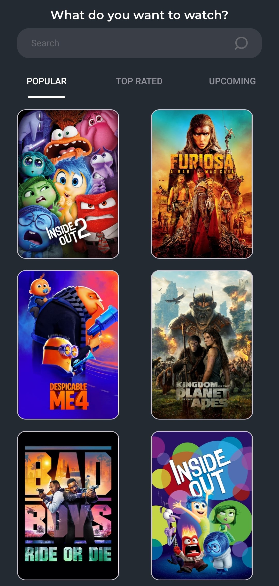
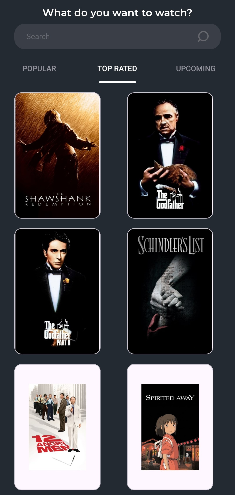
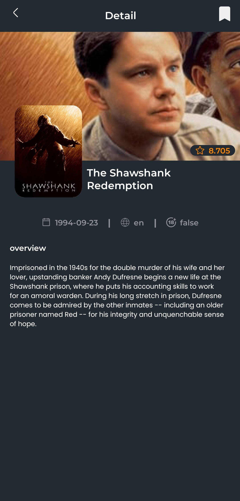
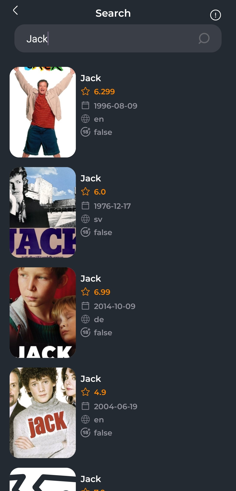
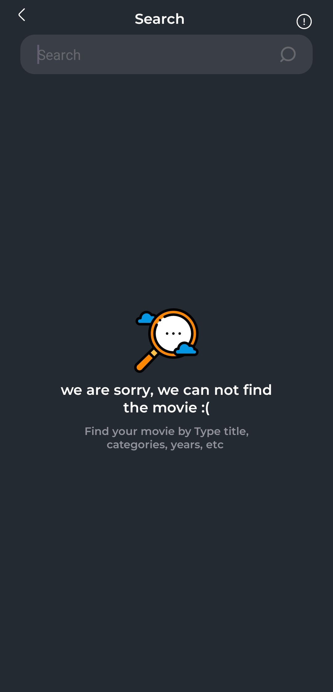

# Movies App

A simple Movies app built using Android with Kotlin, utilizing the Paging 3 library, Retrofit, Hilt for dependency injection, and other Android architecture components. This app fetches movie data from The Movie Database (TMDb) API and displays it in a paginated format using a `TabLayout` with `ViewPager2`.

## Features

- **MVVM Architecture**: Follows the Model-View-ViewModel architecture pattern.
- **Paging 3**: Efficiently loads paginated data.
- **Retrofit**: For network requests.
- **Hilt**: For dependency injection.
- **ViewPager2 with TabLayout**: For navigating between different categories of movies.
- **Flow and ViewModel**: For lifecycle-aware data handling.
- **Coil**: For loading images.
- **Coroutines**: For asynchronous programming.
- **Navigation Component**: For handling navigation and fragment transitions.
- **Room**: For local database storage.
  
## Screenshots
<p align="center">
 

 
</p>
<p align="center">
 
 
</p>

## Getting Started

### Prerequisites

- Android Studio Arctic Fox (2020.3.1) or higher
- Kotlin 1.5.10 or higher

### Installation

1. Clone the repository:
    ```sh
    git clone https://github.com/Tarek-Anwar/Movies.git
    cd Movies
    ```

2. Open the project in Android Studio.

3. Sync the project with Gradle files.

4. Obtain an API key from [The Movie Database (TMDb)](https://www.themoviedb.org/documentation/api).

5. Add your API key to the `gradle.properties` file:
    ```properties
    TMDB_API_KEY=your_api_key_here
    ```

## Architecture

The app follows the MVVM architecture pattern:

- **Model**: Represents the data layer. In this case, the data is fetched from the TMDb API.
- **View**: The UI layer that displays data and sends user actions to the ViewModel.
- **ViewModel**: Provides data to the UI and acts as a communication center between the Repository and the UI.

## Project Structure

- `data`: Contains the data layer, including the API service, models, and the PagingSource.
- `di`: Dependency Injection setup using Hilt.
- `ui`: Contains the UI layer, including Activities, Fragments, and Adapters.
- `viewmodel`: Contains the ViewModel classes.

## Code Overview

### ApiService.kt

Defines the network operations using Retrofit.

```kotlin
interface ApiService {
    @GET("movie/popular")
    suspend fun getPopularMovies(@Query("page") page: Int): MovieResponse
}
